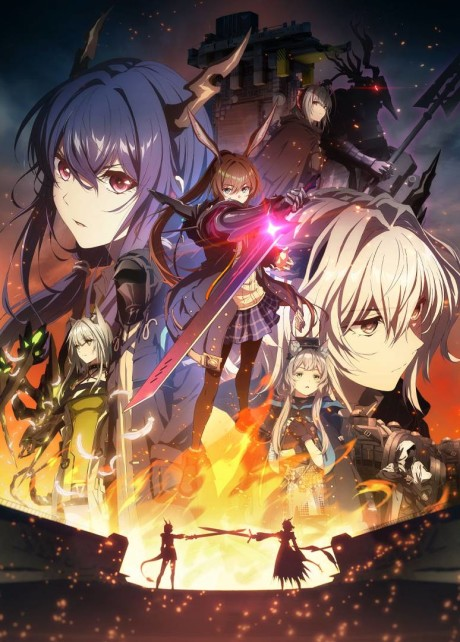

# rootcan deck
**Auteur :** Test  
**Categorie :** KARUTA  
**Type :** NORMAL  

  

**Couverture :**  
  

## Liste des cartes :
### [01 - black bullet]()
&emsp;**Anime :** [Black Bullet](https://anilist.co/anime/20457) - Opening 1  
&emsp;**Artiste(s) :** fripSide, Satoshi Yaginuma  

  

### [02 - Star!!]()
&emsp;**Anime :** [THE IDOLM@STER Cinderella Girls](https://anilist.co/anime/20693) - Opening 2  
&emsp;**Artiste(s) :** CINDERELLA PROJECT, Hidekazu Tanaka  

  

### [03 - Truth]()
&emsp;**Anime :** [Arknights: Enshin Shomei](https://anilist.co/anime/177175) - Ending 1  
&emsp;**Artiste(s) :** Hana Itoki, Hana Itoki  

  

### [04 - Colorful.]()
&emsp;**Anime :** [Saenai Heroine no Sodatekata](https://anilist.co/anime/20657) - Ending 1  
&emsp;**Artiste(s) :** Miku Sawai, Miku Sawai  

  

### [05 - My Dearest]()
&emsp;**Anime :** [Guilty Crown](https://anilist.co/anime/10793) - Opening 2  
&emsp;**Artiste(s) :** supercell, ryo  

  

### [06 - Kuchizuke Diamond]()
&emsp;**Anime :** [Yamada-kun to 7-nin no Majo](https://anilist.co/anime/20966) - Opening 1  
&emsp;**Artiste(s) :** WEAVER, Yuji Sugimoto  

  

### [07 - Nainai]()
&emsp;**Anime :** [Shadows House](https://anilist.co/anime/125038) - Ending 1  
&emsp;**Artiste(s) :** ReoNa, kegani  

  

### [08 - dual existence]()
&emsp;**Anime :** [Toaru Kagaku no Railgun T](https://anilist.co/anime/104462) - Opening 2  
&emsp;**Artiste(s) :** fripSide, Satoshi Yaginuma  

  

### [09 - shØut]()
&emsp;**Anime :** [Re:CREATORS](https://anilist.co/anime/97980) - Opening 2  
&emsp;**Artiste(s) :** SawanoHiroyuki[nZk]:Tielle & Gemie, Hiroyuki Sawano  

  

### [10 - divine intervention]()
&emsp;**Anime :** [Witch Craft Works](https://anilist.co/anime/20503) - Opening 1  
&emsp;**Artiste(s) :** fhána, Junichi Satou  

  

